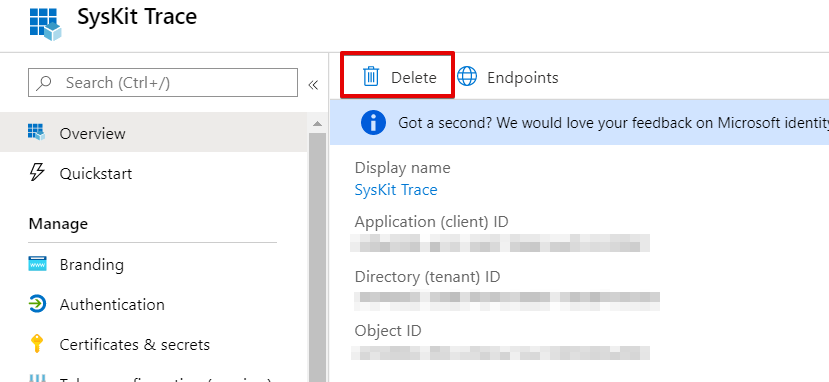

# Office 365 Connection Details

SysKit Trace uses various PowerShell modules to connect to Office 365 and collect data. Each of the powershell modules has its own authentication requirements and potential problems.

One of the goals of SysKit Trace is to collect the data in an unattended manner, regularly, with no user interaction required such as signing in. The solution in such cases is to create an Azure Active Directory Application and perform the actions with the identity of the associated service principal. Unfortunately, this is not possible for all the workloads because they do not support service principals. Some workloads still require the data collected in the context of a user.

## Used PowerShell Modules

SysKit Trace will automatically install the following PowerShell modules to collect the data from Office 365:

* ReverseDSC
* SharePointPnPPowerShellOnline
* MicrosoftTeams
* AzureAD
* Microsoft.PowerApps.Administration.PowerShell

In addition to this, SysKit Trace uses [Office365DSC](https://github.com/microsoft/Office365DSC) but it is not installed as a module available to the user.

## SysKit Trace Azure AD Application

When configuring SysKit Trace an Azure Active Directory Application will be created and pre-consented for the user to collect the data from the tenant. This enables us to consume all of the APIs provided by Microsoft in a standard and well defined way. It also enables us to use modern authentication including Multi-Factor Authentication.  
You can find the SysKit Trace application in the [Azure Portal](https://portal.azure.com/#blade/Microsoft_AAD_IAM/ActiveDirectoryMenuBlade/RegisteredApps) once SysKit Trace has been configured.  
More about the permissions that are consented to automatically is available in the [permission requirements](../requirements/permission-requirements.md#syskit-trace-app-permissions) article.

There are two ways to authenticate an Azure Active Directory Application with Azure AD when using the applications identity.

1. Application secrets
2. Certificates  

SysKit Trace uses certificates for two reasons.

1. Because most of the workloads that are collected support it.
2. And more importantly, because it is the [preferred way](https://docs.microsoft.com/en-us/azure/active-directory/develop/identity-platform-integration-checklist#security) of establishing application authentication.

A certificate is created and imported into the local machine root store.


**Please note!**  
We advise that the machine where SysKit Trace is installed is secure and not shared with other people.


### Deleting the SysKit Trace Azure Active Directory Application

Although removing a connection in SysKit Trace configuration wizard will remove all the data related to that connection \(except for created snapshots\) from your local machine, it will not delete the created Azure Active Directory Application.

To remove created Azure Active Directory Application take the following steps:

1. Go to [Azure Portal](https://portal.azure.com/#blade/Microsoft_AAD_IAM/ActiveDirectoryMenuBlade/RegisteredApps)
2. Type 'SysKit Trace' in the search field and then select the application with the same name.
3. Press Delete

## Multi-Factor Authentication: App Password

In addition to the Azure AD application, an app password is required for the Exhange Online and Security and Compliance workloads when using multi-factor authentication. You can setup app passwords by following [these](https://docs.microsoft.com/en-us/azure/active-directory/user-help/multi-factor-authentication-end-user-app-passwords) instructions. If you are not using multi-factor authentication then you will need to provide your password for the data collection to work.

